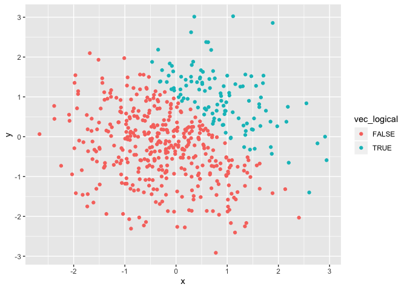
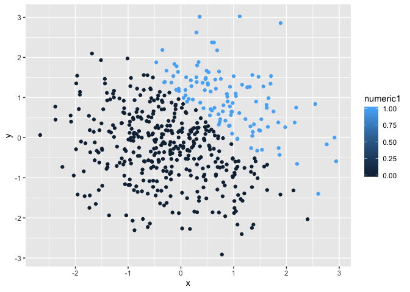
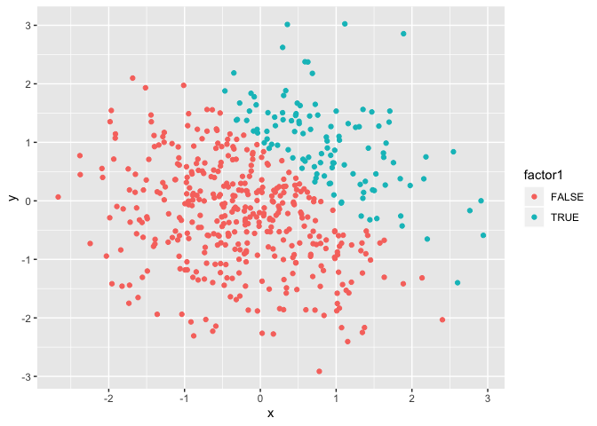

Homework 1
================
Kelly Wang
2019-09-15

# Problem 1

## creating the data frame

``` r
## 1.creating a random sample of size 8 from a standard normal distribution
## 2.a logical vector indicating whether elements of the sample are greater than 0
## 3.a character vector of length 8
## 4.a factor vector of length 8, with 3 different factor "levels"
problem1_df=tibble(
  x= rnorm(8),
  vec_logic = x>0,
  vec_char = c("I'm", "a", "fan", "of", "pineapple", "on", "pizza", "yum!"),
  vec_factor= c("high", "medium", "low", "low", "medium", "high", "medium", "medium")
)
```

\#\#taking mean of each variable in the data frame

``` r
#create variable
number=pull(problem1_df, var=x)
overzero=pull(problem1_df, var=vec_logic)
characters=pull(problem1_df, var=vec_char)
levels=pull(problem1_df, var=vec_factor)

#trying to find mean of each variable
mean(number)
```

    ## [1] -0.01350206

``` r
mean(overzero)
```

    ## [1] 0.5

``` r
mean(characters)
```

    ## Warning in mean.default(characters): argument is not numeric or logical:
    ## returning NA

    ## [1] NA

``` r
mean(levels)
```

    ## Warning in mean.default(levels): argument is not numeric or logical:
    ## returning NA

    ## [1] NA

We can take the mean values of number, overzero, but not of characters
or
levels.

## using as.numeric function to the logical, character, and factor variables

``` r
as.numeric(overzero)
as.numeric(characters)
as.numeric(levels)
```

This cannot turn into any of the logical, character, or factor
vector.

## converting one variable to another

``` r
#convert the logical vector to numeric, and multiple the random sample by the result
y=number*as.numeric(overzero)
y
```

    ## [1] 0.0000000 0.5607329 0.0000000 1.7545845 0.7427413 1.2169457 0.0000000
    ## [8] 0.0000000

``` r
#convert the logical vector to a factor, and multiple the random sample by the result
a=number*as.factor(overzero)
```

    ## Warning in Ops.factor(number, as.factor(overzero)): '*' not meaningful for
    ## factors

``` r
a
```

    ## [1] NA NA NA NA NA NA NA NA

``` r
#convert the logical vector to a factor and then convert the result to numeric, and multiply the random sample by the result
b=number*as.numeric(as.factor(overzero))
b
```

    ## [1] -0.5599323  1.1214657 -1.7294863  3.5091690  1.4854825  2.4338913
    ## [7] -1.2689374 -0.8246648

# Problem 2

## creating data frame of x and y

``` r
problem2_df=tibble(
  x=rnorm(500),
  y=rnorm(500),
  vec_logic=x+y>1,
  a=as.numeric(vec_logic),
  b=as.factor(vec_logic)
)
```

In this data set, there are `<(nrow)>` rows (or number of subjects) and
`<(ncol)>` columns, each denoting a different kind of variable. The mean
of of our sample is `<mean(x)>`, the median is `<median(x)>`, and the
standard deviation is `<sd(x)>`. The proportion of cases for which
x+y\>1 is `(x+y>1)/(x+y)`.

## scatterplots

``` r
#scatterplot of the logic variables
ggplot(problem2_df, aes(x=x, y=y, color=vec_logic)) + geom_point()
```

<!-- -->

``` r
#scatterplot of numeric variable
ggplot(problem2_df, aes(x=x, y=y, color=a)) + geom_point()
```

<!-- -->

``` r
#scatterplot of factor variables
ggplot(problem2_df, aes(x=x, y=y, color=b)) + geom_point()
```

<!-- -->

``` r
#saving ggplot with ggsave
```
